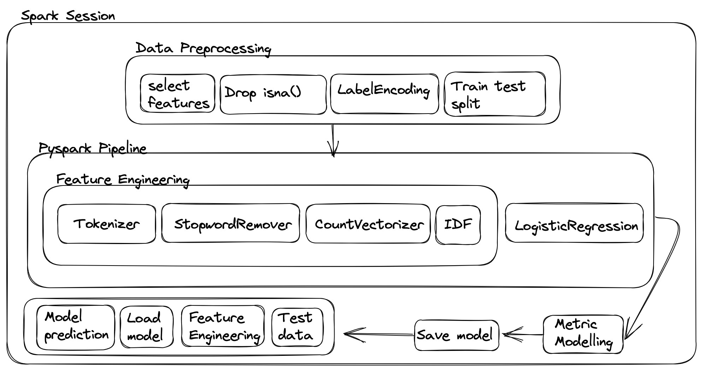

# Text classification notes

imports used:

from pyspark import SparkContext 
from pyspark.sql import SparkSession  // To start or create spark session  

from pyspark.ml.feature import Tokenizer, StopWordsRemover, CountVectorizer, IDF  
from pyspark.ml.feature import StringIndexer // For label encoding/indexing  

from pyspark.ml.classification import LogisticRegression  
from pyspark.ml import Pipeline // end to end pipeline  

from pyspark.ml.evaluation import MulticlassClassificationEvaluator  
from pyspark.mllib.evaluation import MulticlassMetrics // Metrics for multiclass classification  

from pyspark.sql.types import StringTypes // data type of column/entity  
from pyspark.ml.pipline import PipelineModel // To save and load model  

from sklearn.metrics import ConfusionMatrixDisplay, confusion_matrix, classification_report // Metric Monitoring

